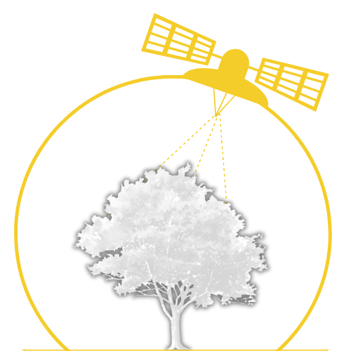

---
hide:
  - navigation
  - toc
---

<section class="tx-section tx-about">
  

    

      
      

        <h2>About Phytospatial</h2>
        
Phytospatial is a Python package designed to process remote sensing data for enhanced forest inventories or vegetation analyses.

        
It allows for the integration of multimodal data (vectors, LiDAR, rasters) for end-to-end pipelines at the individual tree scale.

      

    

  

</section>

<section class="tx-section tx-features">
  

    

      
        <svg xmlns="http://www.w3.org/2000/svg" viewBox="0 0 24 24"><path d="M12 2A10 10 0 0 0 2 12c0 4.42 2.87 8.17 6.84 9.5.5.08.66-.23.66-.5v-1.69c-2.77.6-3.36-1.34-3.36-1.34-.46-1.16-1.11-1.47-1.11-1.47-.91-.62.07-.6.07-.6 1 .07 1.53 1.03 1.53 1.03.87 1.52 2.34 1.07 2.91.83.09-.65.35-1.09.63-1.34-2.22-.25-4.55-1.11-4.55-4.92 0-1.11.38-2 1.03-2.71-.1-.25-.45-1.29.1-2.64 0 0 .84-.27 2.75 1.02.79-.22 1.65-.33 2.5-.33s1.71.11 2.5.33c1.91-1.29 2.75-1.02 2.75-1.02.55 1.35.2 2.39.1 2.64.65.71 1.03 1.6 1.03 2.71 0 3.82-2.34 4.66-4.57 4.91.36.31.69.92.69 1.85V21c0 .27.16.59.67.5C19.14 20.16 22 16.42 22 12A10 10 0 0 0 12 2"/></svg>
      
      <h2>Memory-Safe Processing</h2>
      
Process massive hyperspectral rasters using windowed reading via rasterio without overloading your system RAM.

    

    

      
        <svg xmlns="http://www.w3.org/2000/svg" viewBox="0 0 24 24"><path d="M19 20H4a2 2 0 0 1-2-2V6c0-1.11.89-2 2-2h6l2 2h7a2 2 0 0 1 2 2H4v10l2.14-8h17.07l-2.28 8.5c-.23.87-1.01 1.5-1.93 1.5"/></svg>
      
      <h2>Forestry Focused</h2>
      
Specialized tools tailored for tree crown validation, species labeling, and raster-based data fusion.

    

    

      
        <svg xmlns="http://www.w3.org/2000/svg" viewBox="0 0 24 24"><path d="m18.05 21-2.73-4.74c0-1.73-1.07-2.84-2.37-2.84-.9 0-1.68.5-2.08 1.24.33-.19.72-.29 1.13-.29 1.3 0 2.36 1.06 2.36 2.36 0 1.31-1.05 2.38-2.36 2.38h3.3V21H6.79c-.24 0-.49-.09-.67-.28a.95.95 0 0 1 0-1.34l.5-.5c-.34-.15-.62-.38-.9-.62-.22.5-.72.85-1.3.85a1.425 1.425 0 0 1 0-2.85l.47.08v-1.97a4.73 4.73 0 0 1 4.74-4.74h.02c2.12.01 3.77.84 3.77-.47 0-.93.2-1.3.54-1.82-.73-.34-1.56-.55-2.43-.55-.53 0-.95-.42-.95-.95 0-.43.28-.79.67-.91l-.67-.04c-.52 0-.95-.42-.95-.94 0-.53.43-.95.95-.95h.95c2.1 0 3.94 1.15 4.93 2.85l.28-.01c.71 0 1.37.23 1.91.61l.45.38c2.17 1.95 1.9 3.27 1.9 3.28 0 1.28-1.06 2.33-2.35 2.33l-.49-.05v.08c0 1.11-.48 2.1-1.23 2.8L20.24 21zm.11-13.26c-.53 0-.95.42-.95.94 0 .53.42.95.95.95.52 0 .95-.42.95-.95 0-.52-.43-.94-.95-.94"/></svg>
      
      <h2>Adaptive Extraction</h2>
      
Abstract away memory complexity with an adaptive engine offering In-Memory, Tiled, Blocked, and Auto strategies.

    

  

</section>

<section class="tx-section tx-collaborators">
  

    <h2>Our Team</h2>
    

      

        
        <h3>Louis-Vincent Grand'Maison</h3>
        
Lead Developer

        
PhD candidate at Université Laval

      

      

        
        <h3>Christian Larouche, PhD</h3>
        
Code reviewer

        
Professor in geomatics at Université Laval

      

    

    

      
Join the fun! Whether you are a student or an expert, we welcome your contributions.

      <a href="contributing/contributing/" class="md-button md-button--primary">Become a collaborator</a>
    

  

</section>